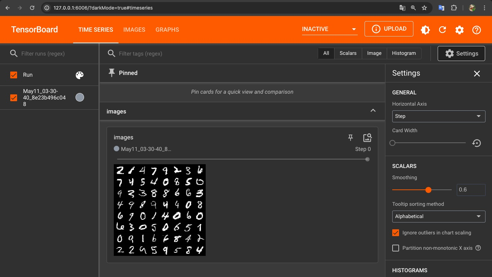
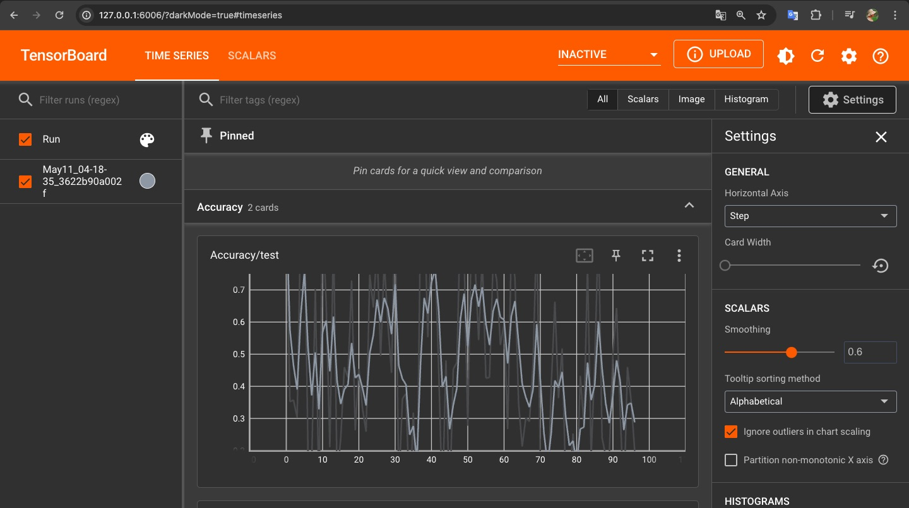

# tensorboard-showcase
* How to build
```
docker build -f docker/pt.dockerfile -t myproj .
```

* How to run
```
docker run -it --rm -p 6006:6006 -v $(pwd):/home/app/ --entrypoint /bin/bash myproj
```

* Run inside docker
```
tensorboard --logdir /home/app/src/show_dataset/runs --host 0.0.0.0
```

* Access by browser `http://127.0.0.1:6006/`




